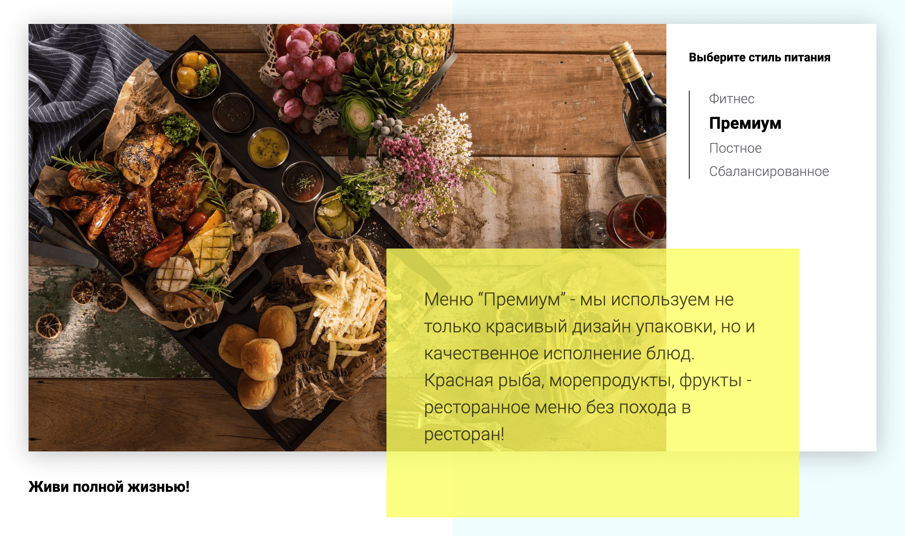

[Потыкать табы и верстку можно здесь](http://food.webofkarma.com/)

[Полный код табов, верстку и стили, можно найти здесь (/js/modules/tabs.js)](https://github.com/priestofkarma/Food/blob/master/src/)

<figure>



<figcaption>Так выглядит верстка табов</figcaption>

</figure>

### Полный код табов

<details>

<summary className="button">Полный код табов</summary>

```js
// Tabs
function tabs(
    tabsSelector,
    tabsContentSelector,
    tabsparentSelector,
    activeClass
) {
    let tabs = document.querySelectorAll(tabsSelector),
        tabsContent = document.querySelectorAll(tabsContentSelector),
        tabsParent = document.querySelector(tabsparentSelector);

    function hideTabContent() {
        tabsContent.forEach((item) => {
            item.classList.add("hide");
            item.classList.remove("show", "fade");
        });

        tabs.forEach((item) => {
            item.classList.remove(activeClass);
        });
    }

    function showTabContent(i = 0) {
        tabsContent[i].classList.add("show", "fade");
        tabsContent[i].classList.remove("hide");
        tabs[i].classList.add(activeClass);
    }

    hideTabContent();
    showTabContent();

    tabsParent.addEventListener("click", function (event) {
        const target = event.target;
        if (target && target.classList.contains(tabsSelector.slice(1))) {
            tabs.forEach((item, i) => {
                if (target == item) {
                    hideTabContent();
                    showTabContent(i);
                }
            });
        }
    });
}
```

</details>    

#### Параметры функции

-   `tabsSelector` - селектор ссылок/кнопок табов (те самые "стили питания")
-   `tabsContentSelector` - селектор контента табов (изображения и их описание)
-   `tabsparentSelector` - селектор родительского элемента для табов (для tabsSelector)
-   `activeClass` - класс активного таба (активный таб выделяется жирным)

### Как работает:

Тут всё просто, находим элементы по селекторам с переданных параметров
функции и присваиваем их переменным.

```javascript{numberLines: 3}
let tabs = document.querySelectorAll(tabsSelector),
    tabsContent = document.querySelectorAll(tabsContentSelector),
    tabsParent = document.querySelector(tabsparentSelector);
```

#### Функция `hideTabContent()`

Используя метод `forEach()`, добавляем к каждому элементу `tabsContent` класс 'hide',
и удаляем классы 'show' и 'fade'.

Класс 'hide' прячет контент, а 'show', 'fade' плавно его показывает.

Также удаляем активный класс (жирность) у всех кнопок табов.

```javascript
function hideTabContent() {
    tabsContent.forEach((item) => {
        item.classList.add("hide");
        item.classList.remove("show", "fade");
    });

    tabs.forEach((item) => {
        item.classList.remove(activeClass);
    });
}
```

#### Функция `showTabContent()`

Тут тоже всё просто, выбирая элементы из псевдомассива по индексу `i`,
классами CSS скрываем или показываем контент, и активным классом выделяем выбранный таб.

`i = 0` - в параметре функции, задает стандартное значение для параметра,
если он не был передан при вызове функции. В данном примере это будет значить
что активный таб - первый.

В строках 27 и 28 вызываем функции для первонального состояния табов.

```javascript{numberLines: 19}
function showTabContent(i = 0) {

    tabsContent[i].classList.add('show', 'fade');
    tabsContent[i].classList.remove('hide');
    tabs[i].classList.add(activeClass);

}

hideTabContent();
showTabContent();

```

#### Добавение обработчика события при клике с использованием делегирования события

На родителя кнопок, добавляем обработчик события `click`.
Колбэком события является анонимная функция, которая проверяет, имеет ли
элемент на который кликнули класс из параметра `tabsSelector` (это класс кнопок, т.е. сами кнопки),
если класс присутствует, то перебираем кнопки, и находим именно тот таб, по которому кликнули.
Далее просто вызываем функции скрытия и показа табов.

В `showTabContent(i)` передаем индекс элемента таба, он и будет активен.

`tabsSelector.slice(1)` метод `slice()` использован для того, что бы обрезать точку в селекторе класса,
так как в метод `contains()` передается имя класса без точки.

```javascript
tabsParent.addEventListener("click", function (event) {
    const target = event.target;
    if (target && target.classList.contains(tabsSelector.slice(1))) {
        tabs.forEach((item, i) => {
            if (target == item) {
                hideTabContent();
                showTabContent(i);
            }
        });
    }
});
```

Вот и всё, функция работает, теперь её можно применять много раз в проекте для разных табов.
