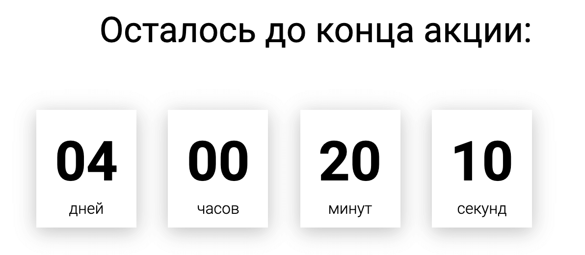

[Подивитися таймер можна тут](http://food.webofkarma.com/#timer-link)

[Повний код таймера, верстку та стилі, можна знайти тут (/js/modules/timer.js)](https://github.com/priestofkarma/Food/blob/master/src/)

<figure>



<figcaption>Так виглядає таймер ⏱</figcaption>

</figure>

### Повний код таймера

<details>

<summary className="button">Повний код таймера</summary>

```js
// timer
function timer(id, deadline) {
    function getTimeRemaining(endtime) {
        const t = Date.parse(endtime) - Date.parse(new Date()),
            days = Math.floor(t / (1000 * 60 * 60 * 24)),
            hours = Math.floor(((t / 1000) * 60 * 60) % 24),
            minutes = Math.floor((t / 1000 / 60) % 60),
            seconds = Math.floor((t / 1000) % 60);

        return {
            total: t,
            days: days,
            hours: hours,
            minutes: minutes,
            seconds: seconds,
        };
    }

    function getZero(num) {
        if (num >= 0 && num < 10) {
            return `0${num}`;
        } else {
            return num;
        }
    }

    function setClock(selector, endtime) {
        const timer = document.querySelector(selector),
            days = timer.querySelector("#days"),
            hours = timer.querySelector("#hours"),
            minutes = timer.querySelector("#minutes"),
            seconds = timer.querySelector("#seconds"),
            timeInterval = setInterval(updateClock, 1000);

        updateClock();

        function updateClock() {
            const t = getTimeRemaining(endtime);
            days.innerHTML = getZero(t.days);
            hours.innerHTML = getZero(t.hours);
            minutes.innerHTML = getZero(t.minutes);
            seconds.innerHTML = getZero(t.seconds);

            if (t.total <= 0) {
                clearInterval(timeInterval);
            }
        }
    }

    setClock(id, deadline);
}

timer(".timer", "2022-05-20");
```

</details>

#### Параметри функції

- `id` - селектор таймеру на сторінці
- `deadline` - дата закінчення дії таймера у форматі "2021-05-26"

### Як працює:

Основне завдання таймера - виводити решту
дні/години/хвилини/секунди від поточного часу до певної дати.

#### Функція для отримання різниці в часі `getTimeRemaining(endtime)`

Параметр функції endtime приймає дату у форматі "2021-05-26".

<InfoMd title="Чому саме у такому форматі?">

Якщо такий скрипт підв'язувати до адміністративної панелі, то в ній може бути
input з type="date", який повертає дату саме у такому форматі.

Детальніше: [input type="date"](https://developer.mozilla.org/ru/docs/Web/HTML/Element/Input/date)

</InfoMd>

А як порахувати різницю у часі?

Насамперед потрібно перевести отриманий рядок дати
у мілісекунди методом `parse` об'єкта `Date`.

[Детальніше про метод `parse`](https://learn.javascript.ru/date#razbor-stroki-s-datoy)

Змінній t привласнюємо різницю часу закінчення та поточного часу.
` new Date()` повертає поточну дату та час.

Змінним `days, hours, minutes, seconds` надають розрахований за формулами час.
У 11 рядку повертаємо об'єкт із цими значеннями.

```javascript{numberLines: 4}
function getTimeRemaining(endtime) {
    const t = Date.parse(endtime) - Date.parse(new Date()),
        days = Math.floor(t / (1000 * 60 * 60 * 24)),
        hours = Math.floor(((t / 1000) * 60 * 60) % 24),
        minutes = Math.floor((t / 1000 / 60) % 60),
        seconds = Math.floor((t / 1000) % 60);

    return {
        total: t,
        days: days,
        hours: hours,
        minutes: minutes,
        seconds: seconds,
    };
}
```

#### Функції для виведення та оновлення часу

##### Функція виведення `setClock(selector, endtime)`

#### Параметри функції:

- `selector` - селектор таймера, який приходить з параметра `id` функції `timer()`
- `endtime` - той самий рядок дати у форматі `"2021-05-26"`

У рядках 28 - 32 шукаємо елементи для виведення часу
на сторінці та надаємо їх відповідним змінним.
Якщо на сторінці буде більше одного таймера, то в selector можна передавати
`id` елемента, а в `days, hours, minutes, seconds` - дочірні елементи з `class`-ми.

##### Функція оновлення часу `updateClock()`

У локальній змінній `t` викликаємо функцію `getTimeRemaining(endtime)`,
яка повертає об'єкт із даними часу.

У рядках 39 - 42 виводимо на сторінку ті самі дані часу у відповідні елементи.

Для того щоб красиво вивести час як на годиннику, обробимо числа функцією `getZero(num)`.

Функція працює просто, вона приймає число в параметрі `num`, і перевіряє, якщо
це число більше або 0 і менше 10, то повертає це число з "0" спочатку.
Інакше – просто повертає це число.

```javascript{numberLines: 19}
function getZero(num) {
    if (num >= 0 && num < 10) {
        return `0${num}`;
    } else {
        return num;
    }
}
```

Для того, щоб час оновлювався кожну секунду, потрібно (як не дивно 😅)
викликати функцію `updateClock()` кожну секунду.

Для цього, змінної `timeInterval` - привласним метод `setInterval(updateClock, 1000)`
в який першим аргументом передамо функцію `updateClock`,
а другим - інтервал часу в мілісекундах, через який щоразу
буде викликатись функція `updateClock`.

Нам потрібно, щоб таймер зупинився після закінчення часу.

Для цього, у рядках 44 - 46 створимо перевірку,
якщо різниця часу закінчення та поточного часу дорівнює або менше 0 – зупиняємо таймер.

```javascript{numberLines: 27}
function setClock(selector, endtime) {
    const timer = document.querySelector(selector),
        days = timer.querySelector("#days"),
        hours = timer.querySelector("#hours"),
        minutes = timer.querySelector("#minutes"),
        seconds = timer.querySelector("#seconds"),
        timeInterval = setInterval(updateClock, 1000);

    updateClock();

    function updateClock() {
        const t = getTimeRemaining(endtime);
        days.innerHTML = getZero(t.days);
        hours.innerHTML = getZero(t.hours);
        minutes.innerHTML = getZero(t.minutes);
        seconds.innerHTML = getZero(t.seconds);

        if (t.total <= 0) {
            clearInterval(timeInterval);
        }
    }
}

setClock(id, deadline);
```

У рядку 53 викликаємо функцію `timer(id, deadline)`.

```javascript{numberLines: 27}
timer(".timer", "2022-05-20");
```

Ось і все, функцією можна скористатися :)

Функцію можна всіляко модифікувати. Можна оновлювати таймер після закінчення часу,
це так званий "фейковий таймер". Можна викликати інші функції після закінчення таймера,
або у будь-який інший час.