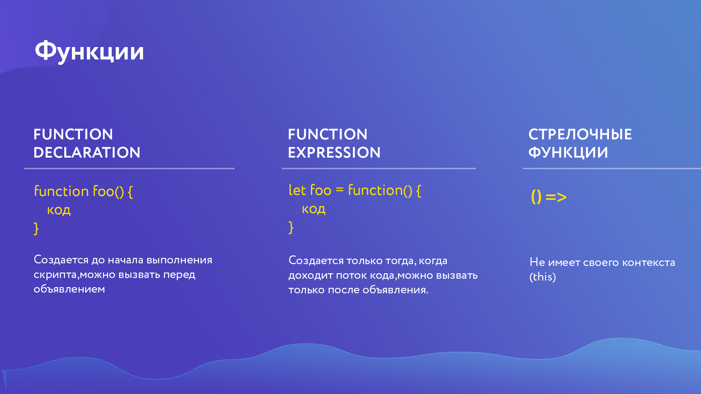

[Функції](https://learn.javascript.ru/function-basics)

### Створення функцій



---

```jsx
// Створити функцію (function declaration)
function functionName(param) {
 // ...body of function...
}

// Викликати функцію
functionName('paramName');

// Повернення значення функції
function functionName(param) {
  // ...body of function...
	let num = param;
	return num;
  // код після return не виконується
}

// function expression
// Створюється лише тоді, коли до неї доходить код
let foo = function() {
	...some code...
}

foo();

// Стрілочні функції
const calc = (a, b) => a + b;
```

### Замикання функцій

[Я ніколи не розумів замикання JavaScript](https://medium.com/nuances-of-programming/я-никогда-не-понимал-замыкания-в-javascript-часть-первая-3c3f02041970)

[Замикання](https://learn.javascript.ru/closure)

### Callback-функції

```jsx
function first() {
    // Do something
    // Емулюємо затримку (відповідь від сервера тощо)
    setTimeout(function () {
        console.log(1);
    }, 500);
}

function second() {
    // Do something
    console.log(2);
}

first();
second();

/* 
	console:
	2
  	1
 */

function learnJS(lang, callback) {
    console.log(`Я учу: ${lang}`);
    callback();
}

function done() {
    console.log("Я пройшов цей урок!");
}

learnJS("JavaScript", done);

/*
 * Я вчу: JavaScript
 * Я пройшов цей урок!
 */
```
