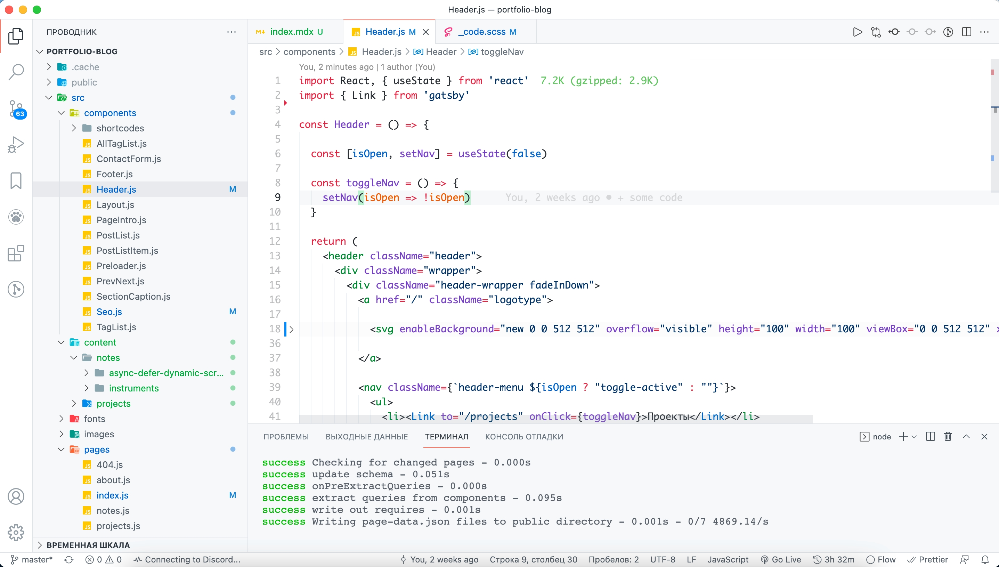

Это живой документ с программным обеспечением, инструментами и ссылками 
которыми я пользуюсь - может быть, он вам пригодится 😊

Самое главное - компьютер, я 
пользуюсь [MacBook Air](https://www.apple.com/ru-edu/shop/buy-mac/macbook-air) 13" M1 RAM 16gb / SSD 512gb 2020

[Полезные ссылки 👨‍💻 для веб-разработчика от Glo Academy](https://aislam23.github.io/links/)

### Программы, которыми я пользуюсь

- [Transmit](https://panic.com/transmit/) - FTP клиент для Mac и [WinSCP](https://winscp.net/eng/docs/lang:ru) для Windows
- [Notion](https://www.notion.so/) для заметок, очень крутой wiki инструмент
- [Things](https://culturedcode.com/things/) менеджер задач и проектов
- [PixelmatorPro](https://www.pixelmator.com/pro/) и [Photoshop](https://www.adobe.com/ru/products/photoshop.html) для редактирования изображений
- [Figma](https://www.figma.com/) для дизайна, обычно в ней предоставляют дизайн-макеты для вёрстки
- [CoinKeeper](https://about.coinkeeper.me/) для учета денежных расходов и доходов
- [Spark](https://sparkmailapp.com/) почтовый клиент

### Редактор кода, плагины, темы

В основном я пользуюсь <a href="https://code.visualstudio.com/" target="_blank">Visual Studio Code</a>,
иногда <a href="https://www.jetbrains.com/webstorm/" target="_blank">WebStorm</a>

#### Мой редактор кода выглядит так:

#### Темы

Я пользуюсь светлой темой [GitHub Theme](https://marketplace.visualstudio.com/items?itemName=GitHub.github-vscode-theme)

-  Также мне очень нравятся [Bluloco Light Theme](https://marketplace.visualstudio.com/items?itemName=uloco.theme-bluloco-light) и [Bluloco Dark Theme](https://marketplace.visualstudio.com/items?itemName=uloco.theme-bluloco-dark)

-  Иконки для VS Code - [Material Icon Theme](https://marketplace.visualstudio.com/items?itemName=PKief.material-icon-theme)
    

#### Плагины

-  [Visual Studio IntelliCode](https://visualstudio.microsoft.com/ru/services/intellicode/)

    Разработка с помощью ИИ, помогает экономить время и писать код быстрее

-  [GitLens — Git supercharged](https://marketplace.visualstudio.com/items?itemName=eamodio.gitlens)

    Расширяет возможности Git, визуализирует авторство кода с помощью аннотаций  прямо в коде, и многое другое

-  [JavaScript (ES6) code snippets](https://marketplace.visualstudio.com/items?itemName=xabikos.JavaScriptSnippets)

    Сниппеты кода для JavaScript в синтаксисе ES6

-  [ESLint](https://marketplace.visualstudio.com/items?itemName=dbaeumer.vscode-eslint)

    Интегрирует ESLint JavaScript в VS Code

-  [Auto Rename Tag](https://marketplace.visualstudio.com/items?itemName=formulahendry.auto-rename-tag)

    Автоматическое переименование парного тега HTML / XML (не понимаю, почему этой функции нет в VS Code из коробки 🤷🏻)

-  [Bookmarks](https://marketplace.visualstudio.com/items?itemName=alefragnani.bookmarks)

    Закладки в коде, между которыми можно быстро перемещаться
    
-  [Code Time](https://marketplace.visualstudio.com/items?itemName=softwaredotcom.swdc-vscode)

    Code Time - это плагин с открытым исходным кодом, который предоставляет метрики программирования прямо в Visual Studio Code.
    Записывает, сколько времени вы тратите на кодирование, в каких проектах, на каких языках. Создает еженедельные отчеты.

-  [Image preview](https://marketplace.visualstudio.com/items?itemName=kisstkondoros.vscode-gutter-preview)

    Показывает предварительный просмотр изображения в строке нумерации и при наведении курсора

-  [Import Сost](https://marketplace.visualstudio.com/items?itemName=wix.vscode-import-cost)

    Отображает размер импортируемого / необходимого пакета в редакторе

-  [Live Server](https://marketplace.visualstudio.com/items?itemName=ritwickdey.LiveServer)

    Запускает локальный сервер разработки с функцией перезагрузки в реальном времени для статических и динамических страниц.

-  [Path Intellisense](https://marketplace.visualstudio.com/items?itemName=christian-kohler.path-intellisense)

    Плагин VS Code для автозаполнения имен файлов

-  [Prettier - Code formatter](https://marketplace.visualstudio.com/items?itemName=esbenp.prettier-vscode)

    Форматирование кода
