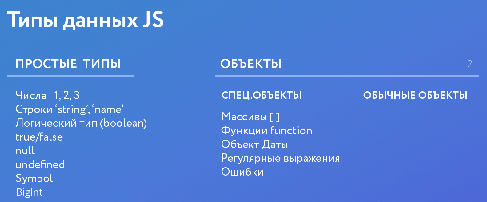

#### Типы данных




#### Strict mode / строгий режим

[Strict mode - JavaScript | MDN](https://developer.mozilla.org/ru/docs/Web/JavaScript/Reference/Strict_mode)

```js
"use strict";
```

Всё что мы получаем от пользователя - тип данных строка

---

### Стилистика кода JS


#### Интерполяция

```jsx
const category = "toys";
// пример использования
consoloe.log(`https://someurl.com/${category}`);

// внутри ${} можно выполнять функции, или вставлять переменные 
```

### Операторы в JS

#### Конкатинация

```jsx
// Строка + строка
'arr' + ' - object' // arr - object

// Число + строка
4 + ' - object' // 4 - object
// Если строку превратить с число унарным плюсом
4 + +' - object' // NaN
4 + +'5' // 9
```

#### Инкремент и декремент

```jsx

let incr = 10,
		decr = 10;

// Постфиксная форма
incr++;
decr--;

console.log(incr, decr); // 11, 9

// Префиксная форма
++incr;
--decr;

console.log(incr, decr); // 11, 9

/* Если использовать сразу, 
 * постфиксная форма сначала возвращает
 * старое значение (10), а уже после него
 * увеличивает или уменьшает
*/

console.log(incr++, decr--); // 10, 10
```

#### Оператор остаток

```jsx
// (%) возвращает остаток от деления
5%2 // 1
```

#### Оператор отрицания

```jsx
// Оператор отрицания !
isChecked || !isClose // false
```

#### Оператор равенства

```jsx
// Оператор равенства "==" и "==="
2*4 == 8 // true
2*4 == "8" // true
2*4 === "8" // false (строгое сравнение, сравнивает по типу данных)

// Оператор равенства с отрицанием "!=" и строгим отрицанием "!=="
2 + 2 * 2 != 8 // true
2 + 2 * 2 != '6' // false
2 + 2 * 2 !== '6' // true
```

#### Логические операторы

```jsx
// Логический оператор И &&
const isChecked = true,
			isClose = true;

isChecked && isClose // true

// Логический оператор ИЛИ || 
const isChecked = true,
			isClose = false;

isChecked || isClose // true

// Оператор c отрицанием
isChecked && !isClose // true
```

---

#### Таблица приоритетов операторов

[Таблица приоритетов операторов](https://developer.mozilla.org/ru/docs/Web/JavaScript/Reference/Operators/Operator_Precedence#Table)