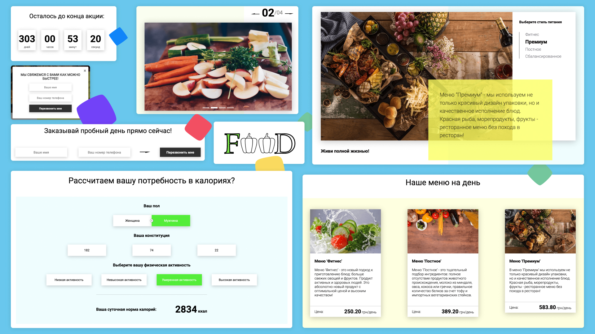
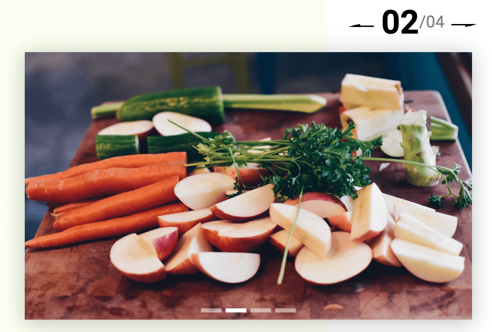
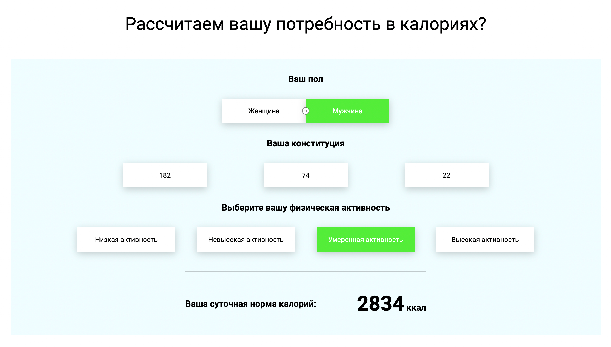
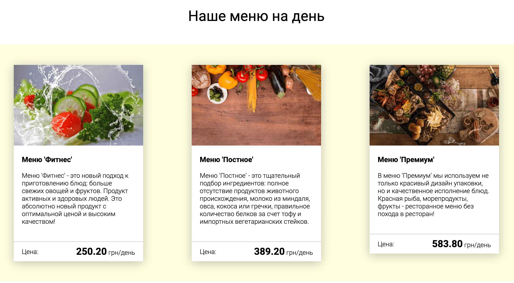
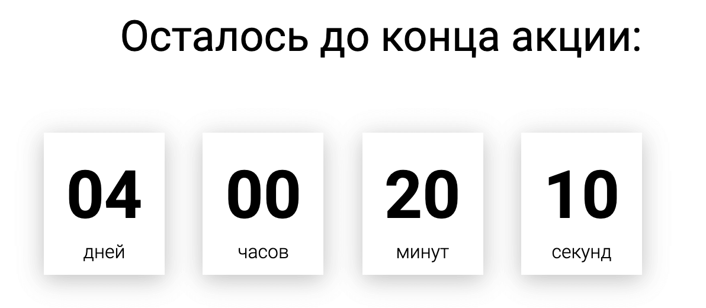

Цей проект зроблено за курсом Івана Петриченка: <a href="https://www.udemy.com/course/javascript_full/" target="_blank" rel="nofollow">Повний курс JavaScript + React - з нуля до результату</a>

Повний код з описом деяких функцій є в 
**[репозитории GitHub](https://github.com/priestofkarma/food)**, 
а також на сторінках **<Link to="/notes/food-tabs">Як зробити таби на чистому JavaScript</Link>** и 
**<Link to="/notes/food-timer">Як зробити таймер на чистому JavaScript</Link>** 

##### Завдання проєкту:

- Додати функціональність:
     - Таби
     - слайдер (карусель зображень)
     - Калькулятор добової норми калорій
     - Картки. Виведення даних із бази даних у форматі json
     - Надсилання даних з контактної форми до бази даних json
     - Таймер зворотного відліку
     - Модальне вікно
- Модульно зібрати проект за допомогою імпортів та експортів ES6-го стандарту

### Модулі-функції сайту:

#### Таби

Залежно від вибраного стилю живлення змінюється зображення та опис.
Досить поширена функціональність на сайтах 🙂

#### Слайдер (карусель зображень)

Звичайна карусель зображень, можна керувати стрілками та точками (поінтами).
Показує загальну кількість слайдів та номер активного слайду.

#### Калькулятор добової норми калорій із збереженням даних у localStorage

Формули для калькулятора взяті з Інтернету.
Приймає такі значення як:
- Стать
- Зріст
- Вага
- Вік
- фізична активність протягом дня

У localStorage зберігається підлога та фізична активність

#### Картки

Виведення даних картки походить з бази даних формату json на сервері.

Виводяться:
- Зображення
- Назва меню
- Опис меню
- Ціна меню, що задається в доларах і програмно конвертується в гривні

#### Форма замовлення та модальне вікно

Форма замовлення в модальному вікні, так само форма є і в інших блоках сайту.
Модальне вікно відкривається при натисканні на копії "Зв'язатися з нами",
за таймером (через деякий час, коли користувач зайшов на сайт)
і також показується один раз, коли сторінка перегорнута в низ.

<InfoMd title="Інфромація">

На сервері є база даних db.json, з якої витягуються дані для карток меню, але я не маю php скрипта
для відправлення даних форми в цей файл json :(
Можливо, незабаром я виправлю це 🙃

</InfoMd>

#### Таймер зворотного відліку

Обычный Таймер зворотного відліку, виводить дні, години, хвилини та секунди, до певної дати.

