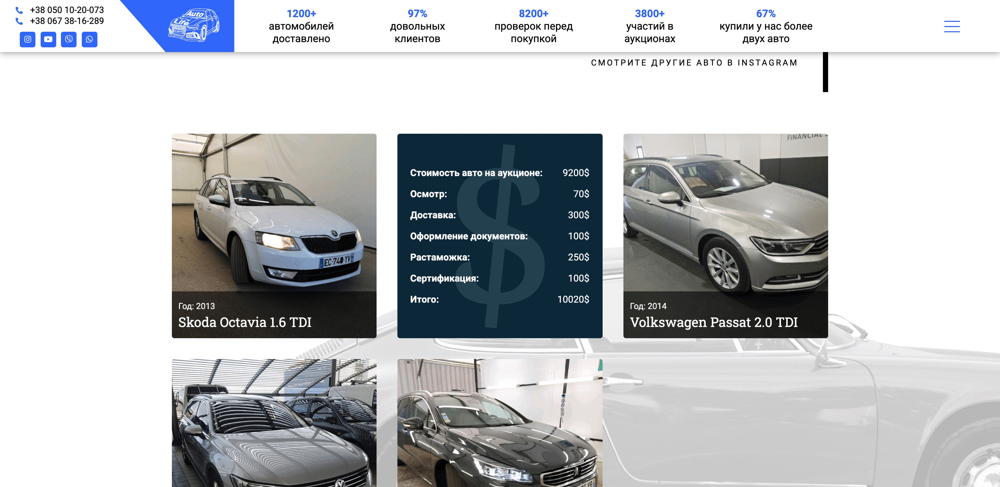

##### Задачи:

-   Разработать дизайн нескольких страниц
-   Страницы:
    -   Главная, секции:
        -   "Горячие" автомобили
        -   Услуги
        -   Краткое описание аукционов
        -   Ответы и вопросы
        -   Отзывы клиентов
        -   Интеграция инстаграмма
    -   Страница с полным описанием действий компании при заказе автомобиля
    -   Страница с инструкцией по заказу авто из аукционов
    -   Страница "О нас" с описанием компании
-   Создать таможенный калькулятор
-   Создать формы обратной связи

### ✅ Созданы все страницы по дизайну

### ✅ Созданы карточки "горячих" автомобилей с информацией

### ✅ Создан таможенный калькульятор автомобиля с помощью плагина

Калькульятор считает:

-   Стоимость растоможки
-   Акциз
-   Пошлину
-   НДС

### ✅ Есть блок под отзывы клиентов

### ✅ Создан блок часто задаваемых вопросов

### ✅ Присутсвуют формы обратной связи, и ссылки на номера телефонов и соц.сети.   Связяться будет очень легко:)

