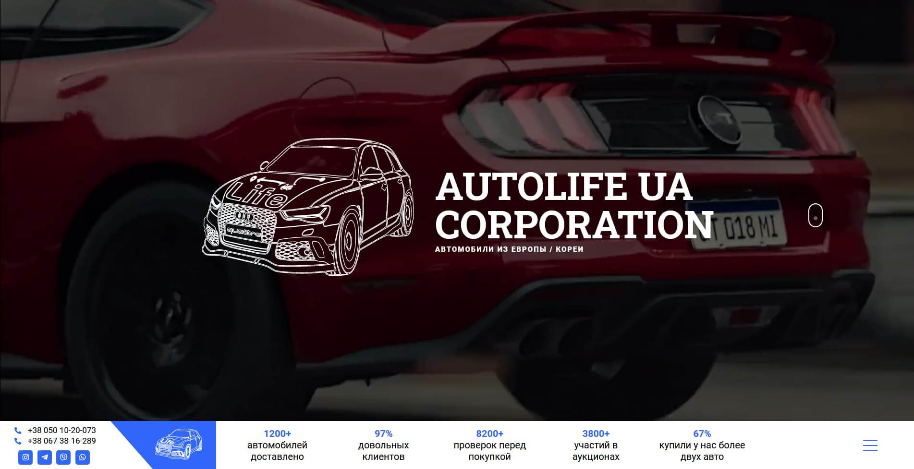

### ✅ Создан таможенный калькульятор автомобиля с помощью плагина

Калькульятор счиатет:

-   Стоимость растоможки
-   Акциз
-   Пошлину
-   НДС

### ✅ Интегрирован инстаграмм для быстрого просмотра автомобилей на сайте

Можно быстро просмотреть последние посты из инстаграмма, не переходя в него. Видны лайки, комментарии, теги.

### ✅ Есть блок под отзывы клиентов

### ✅ Присутсвуют формы обратной связи, и ссылки на номера телефонов и соц.сети.   Связяться будет очень легко:)

