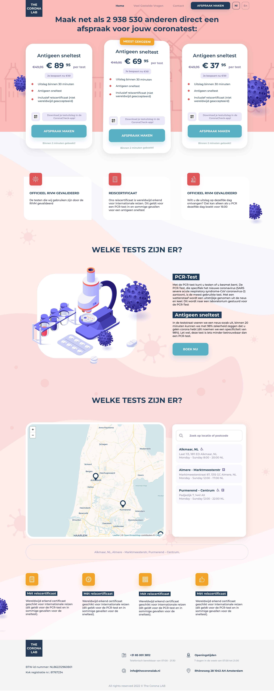
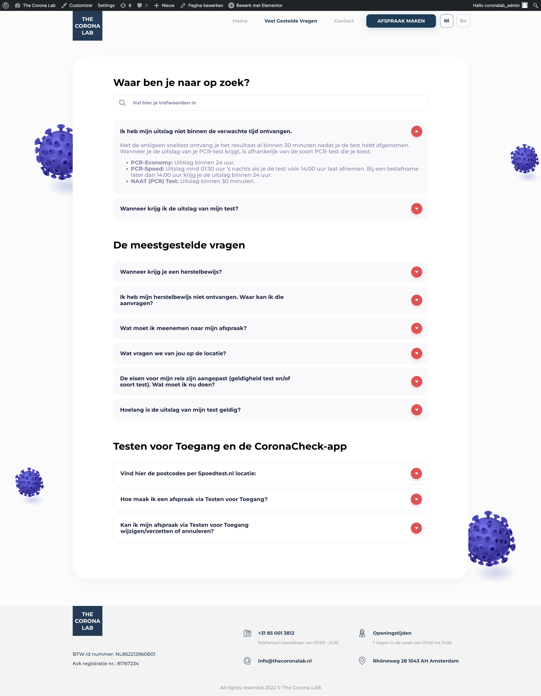

##### Дизайн та менеджмент проекту: <a href="https://t.me/grytsay14" target="_blank">Vasyl Grytsay</a>

##### Завдання:

- Зверстати сайт на Elementor
- Зробити сайт багатомвним
- Зробити можливість додавити нові відділення лікарень на карту
- Написати скрипт для пошуку відділення, де можна зробити тест, на мапі
- Зробити сторінку "часто задавані питання"

## ✅  Реалізована мапа з відділеннями лікарень

Мапа створена за допомгою бібліотеки <a href="https://leafletjs.com" target="_blank">Leaflet</a>. 
Є фільтрація лікарень по назві, при виборі лікарні - вона показується на мапі.

##### Робота мапи:

<Video videoSrcURL="../../../video-corona.mp4" videoTitle="Мапа з відділеннями лікарень"></Video>

### ✅ Зверстаний сайт на Elementor

### ✅ Сторінка FAQ

