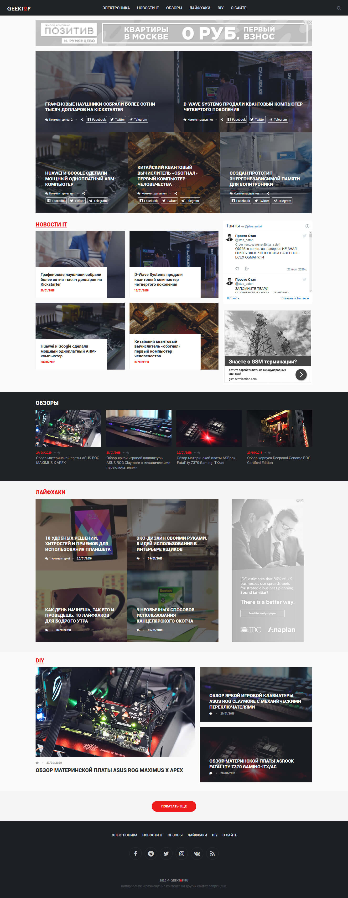

Сайт зібраний за допомогою генератора статичних сайтів **<a href="https://jekyllrb.com/" target="_blank">Jekyll</a>**.

**Jekyll** - це
потужна безпечна платформа для створення статичних контентних сайтів будь-якого
напрямки, від кулінарних, новинних, сайтів про здоров'я, ігри, кіно до більш
складних фото-каталогів, онлайн-кінотеатрів та інших цікавих проектів із зручним
управлінням статтями та категоріями.

<InfoMd title="Info">

Я спробував <a href="https://www.gatsbyjs.com/" target="_blank">Gatsby</a>, і він мені більше сподобався,
у ньому використовується компонентний підхід<a href="https://reactjs.org/" target="_blank">React.js</a>,
(а реакт мені дуже подобається), Gatsby автоматизує поділ коду, оптимізацію зображень,
вбудовування критичних стилів, відкладене завантаження, попередню вибірку ресурсів та багато іншого,
щоб забезпечити повну оптимізацію сайту. Також не вимагає ручного налаштування.

</InfoMd>

#### Швидкість завантаження сайту

Статика, створена Jekyll, завантажується в десятки разів швидше за будь-яку CMS,
використовує генерацію на стороні сервера та реляційну базу даних MySQL.
Пошукові системи люблять швидкі веб-сайти. Це незаперечний факт. Створюючи сайт на
Jekyll можна уникнути багатьох проблем з просуванням, вже на етапі проектування.

 
Головна сторінка

 
Сторінка категорії

 
Сторінка посту

