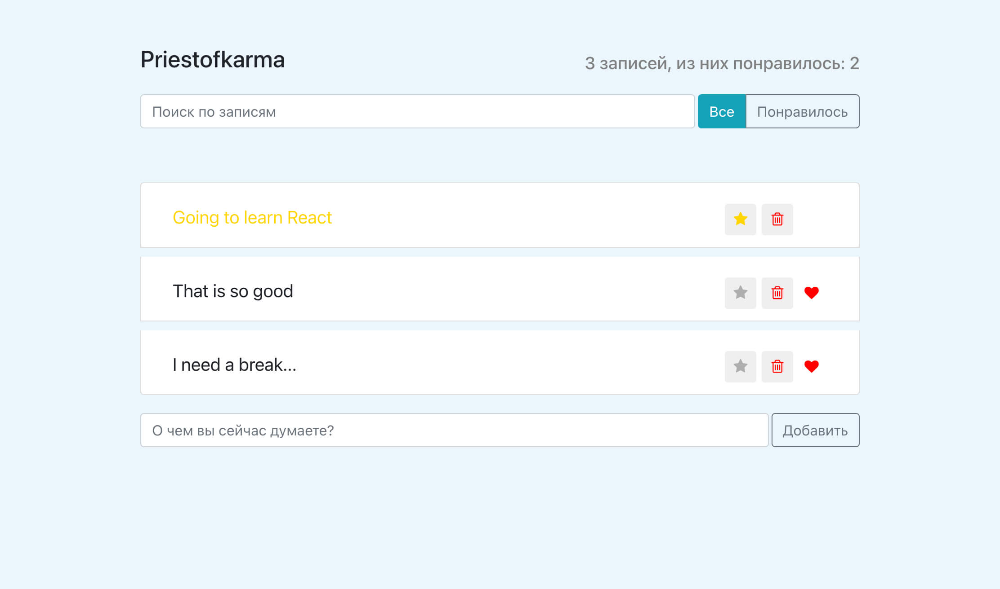
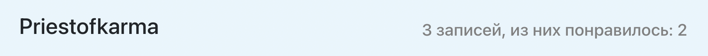
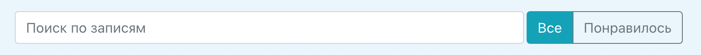
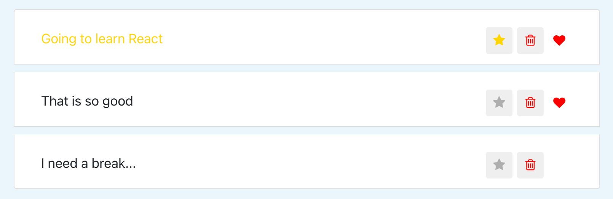
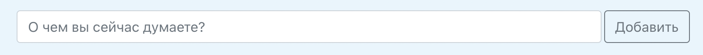

Этот проект сделан по курсу Ивана Петриченко: <a href="https://www.udemy.com/course/javascript_full/" target="_blank" rel="nofollow">Полный курс по JavaScript + React - с нуля до результата</a>

### Приложение выглядит вот так 😊

**[Репозиторий GitHub](https://github.com/priestofkarma/mini-twitter)**

Функциональность приложения предоставляет добавлять новые записи,
удалять/лайкать/добавлять в избранное уже существующие записи, искать по записям,
а так же фильтровать по понравившимся записям.

<InfoMd title="Информация">

Приложение не использует базы данных, поэтому при перезагрузке страницы все изменения пропадут.
Возможно, в скором времени я исправлю это 🙃

</InfoMd>

### Компоненты приложения:

#### AppHeader | Шапка приложения

Шапка приложения. Показывает имя пользователя, количество записей и количество понравившихся записей.

#### SearchPanel (search form and StatusFilter) | Поисковая форма и кнопки фильтрации

Форма поиска, позволяет искать записи по словам. Можно фильтровать сообщения по понравившимся.

#### PostList and children PostListItem | Список записей и компонент записи

Список записей. Вы можете добавлять сообщения в избранное, удалять, и ставить лайки.

#### PostAddForm | Форма для добавления записей

Форма для добавления записей

